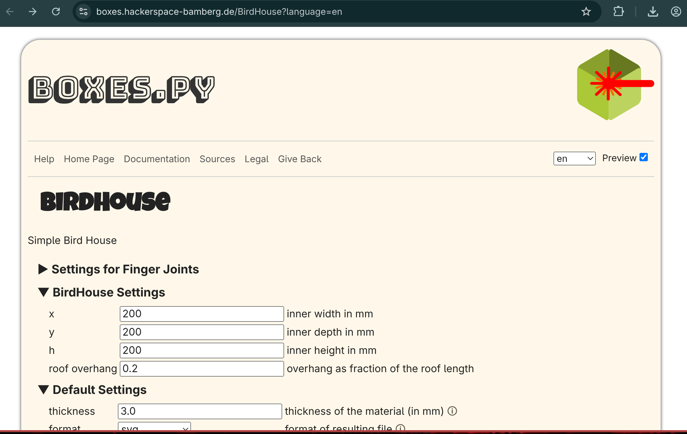
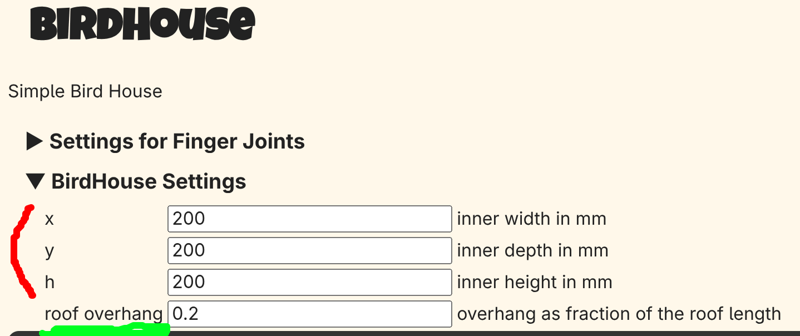
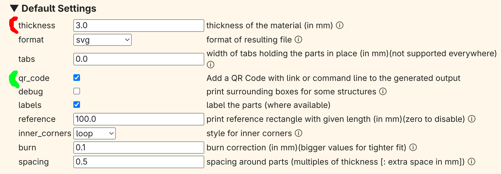
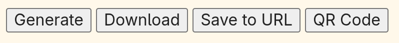
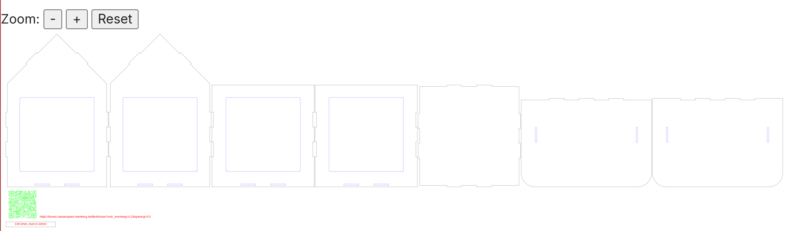

# Tutorial Overview
In this tutorial, we will be using the open source python script boxes.py, available on a public website, to design a house that can be cut on a laser cutter. Boxes.py uses an inkscape plugin to create SVG files compatible with laser cutters and able to be edited in inkscape.

# Image

{width=110%}

{width=140%}

{width=140%}

# Links

Boxes.py house creator - [https://boxes.hackerspace-bamberg.de/BirdHouse](https://boxes.hackerspace-bamberg.de/BirdHouse)
